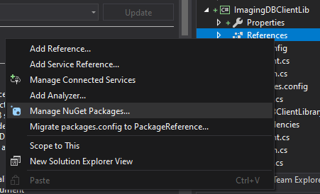
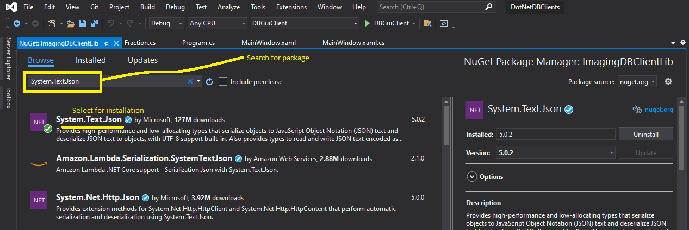
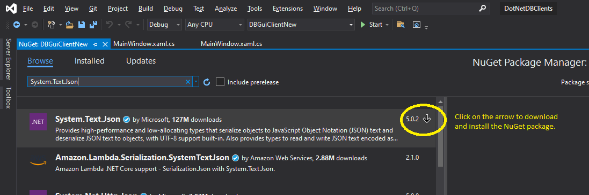

# .NET Client Libraries for Imaging DB

This folder contains the Imaging DB front end library for .NET applications. It is a think wrapper over the RESTful APIs exposed by the service and helps query it. The class library that provides this facility is located in the `ImagingDBClientLibrary` folder. It can be built to produce the .NET assembly for use with any client applications.

The `DBGuiClient` project is a reference client project, which uses the library to query and display results from the Imaging DB.

## Installing Requirements
Since the JSON deserialisation packages for .NET 4.7.2 and above are not available by default, they need to be installed for any client applications that use the Imaging DB library. To do so, the following steps should be followed:

1. Right click on the References for the project usin this library in the solution explorer and select "Manage NuGet Packages". 

2. Search for the System.text.Json package. 

3. Download and install the package. 

## Using the Client Library
To use the client library, add a refrence to the `ImagingDBClientLibrary` and then instantiate the DBClient class. The operations on this class can throw the `HttprequestException`.

```C#
try
{
    var dbClient = new ImagingDBClientLibrary.DBClient(baseUrl, accessToken);
    var allFractions = await dbClient.getAllFractions();
    patientsDataGrid.ItemsSource = allFractions.fractions;
}
catch (System.Net.Http.HttpRequestException ex)
{
    MessageBox.Show("Could not establish to the data server: " + ex.Message);
}

```